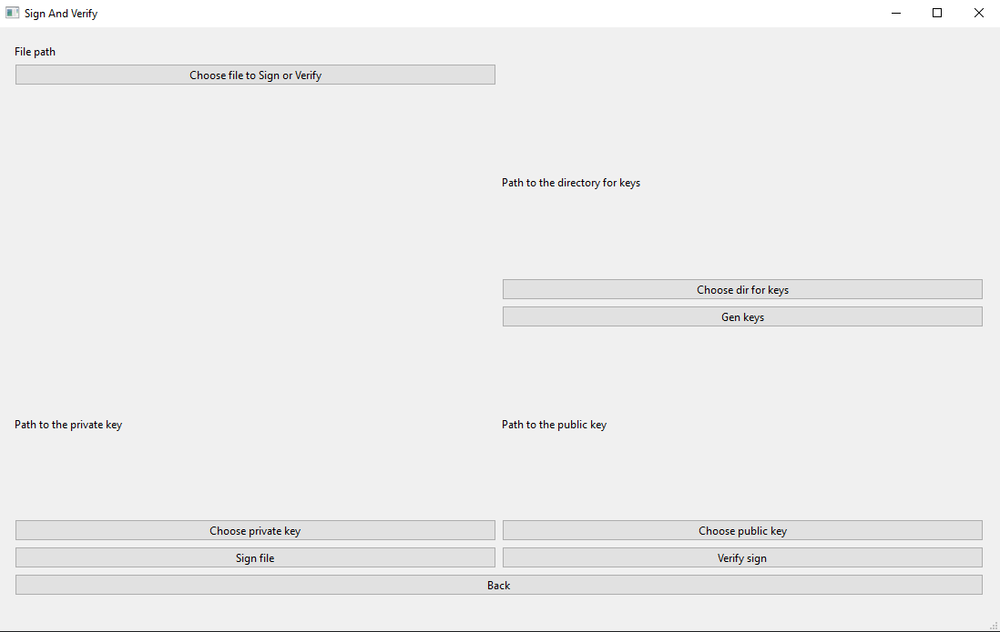

# CryptoTool

Приложение на Qt для подписи файлов и проверки цифровой подписи через OpenSSL.

## Что умеет

- Генерация пары ключей RSA 2048 (приватный + публичный).
- Подпись файла приватным ключом.
- Проверка подписи публичным ключом.

## Технологии

- C++17
- Qt 6 (Widgets)
- OpenSSL

## Требования

- Qt 6.12.0 (MSVC 2022, 64-bit)
- OpenSSL в `PATH` (проверка: `openssl version` в терминале).

## Сборка

### Через Qt Creator

1. Открыть `CryptoTool.pro`.
2. Настроить kit (Qt 6).
3. Build → Run.

## Как пользоваться

После запуска нажмите кнопку **«Start»**.

### Генерация ключей

1. Нажмите **«Choose dir for keys»** — выберите папку для ключей.
2. Нажмите **«Gen keys»**.
3. В папке появятся `private_key.pem` и `public_key.pem`.

> ⚠️ **`private_key.pem`** — не передавайте никому.
> **`public_key.pem`** можно распространять.

### Подпись файла

1. Нажмите **«Choose file to sign or verify»** — выберите файл (например, `abc.zip`).
2. Нажмите **«Choose private key»** — выберите `private_key.pem`.
3. Нажмите **«Sign file»**.
4. Рядом с `abc.zip` появится файл подписи `abc.zip.sig`.

### Проверка подписи

1. Нажмите **«Choose file to sign or verify»** — выберите файл (`abc.zip`).
2. Нажмите **«Choose public key»** — выберите `public_key.pem`.
3. Нажмите **«Verify sign»**.
4. Приложение покажет, верна ли подпись.
